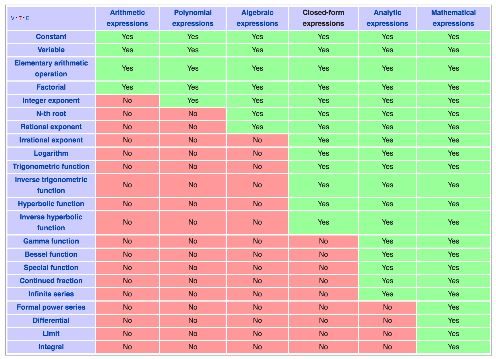

XAlg
-------

A nascent and experimental haskell library for computer algebra via domain specific languages instantiating type classes.

This project is earlier in its life than I would normally make public, but I decided to upload it after just discussing aspects of it at a Haskell Meetup goup. I also summarized one approach taken in [a blog post](http://fieldstrength.org/posts/2016-10-11-Classy-Recursion.html).

There are many holes and bugs present. At this stage it effectively serves as a primitive REPL.

### Aims

The idea is to support a hierarchy of mathematical DSLs for use in physics and other areas of applied math.

This table [from wikipedia](https://en.wikipedia.org/wiki/Expression_(mathematics) can be a reference delimiting some appropriate levels of description to target.

